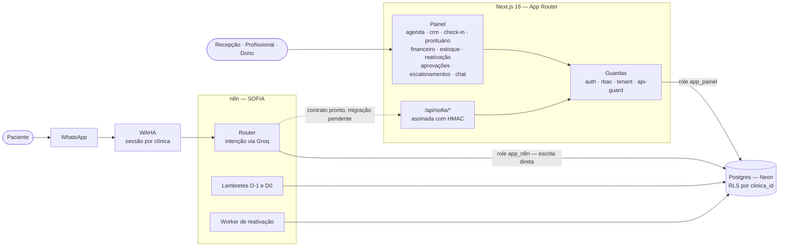

# EXODUS · Clinic Automation

Painel operacional do **AIOS.clinic**: onde o atendimento sai do WhatsApp com a
**SOFIA** e entra na operação da clínica — check-in, identidade, prontuário,
agenda, financeiro, estoque e reativação.

Três nomes que aparecem no código e valem separar: **EXODUS** é a marca,
**AIOS.clinic** é o produto, **SOFIA** é a persona que conversa no WhatsApp.

A ideia que organiza tudo: **o modelo lê texto de gente, e as decisões ficam com
as regras.** A SOFIA interpreta o que o paciente escreveu; quem decide se o
horário existe, se o vínculo autoriza e se a ação precisa de aprovação é uma
função determinística — e, no limite, uma política do banco. Erro do modelo vira
dado errado que alguém vê e corrige, não ação executada.

## O problema

Uma clínica pequena perde dinheiro em lugares que ninguém vê: a consulta
confirmada por ninguém que vira no-show, o paciente que sumiu há oito meses e
nunca foi chamado de volta, o material consumido que não baixou do estoque, o
atendimento feito que não virou cobrança, a mensagem clínica respondida pela
recepção porque o profissional não foi avisado.

São problemas de **coordenação** — e é isso que o sistema faz.

## Como as peças se ligam



Os diagramas completos — componentes, entidades, papéis, máquinas de estado e
sequências — estão em **[`docs/uml/`](docs/uml/)**, com as fontes PlantUML e as
imagens geradas. A versão explicada em texto fica em
[`docs/UML.md`](docs/UML.md).

## O que sustenta o isolamento

Multi-tenant de verdade, não por `WHERE clinica_id = ?` espalhado pelo código.

`.planning/seguranca/001-lockdown.sql` não tem lista de tabelas: varre o
`pg_catalog` atrás da coluna `clinica_id` e aplica em cada uma que achar:

```sql
ALTER TABLE <t> ENABLE ROW LEVEL SECURITY;
ALTER TABLE <t> FORCE  ROW LEVEL SECURITY;
CREATE POLICY rls_tenant ON <t>
  USING      (clinica_id = NULLIF(current_setting('app.clinica_id', true), '')::int)
  WITH CHECK (clinica_id = NULLIF(current_setting('app.clinica_id', true), '')::int);
```

É **fail-closed**: sem o GUC na sessão, `current_setting` devolve vazio,
`NULLIF` vira `NULL`, a comparação nunca é verdadeira, a consulta traz zero
linhas. Esquecer de setar o tenant fecha o banco em vez de abrir. E é **FORCE**:
nem o dono da tabela escapa — o app usa a role `app_painel`, que é
`NOBYPASSRLS`.

Ver [`docs/uml/09-isolamento-tenant.puml`](docs/uml/09-isolamento-tenant.puml).

## Decisões que valem saber antes de ler o código

- **Papel decide o que se vê.** recepção / médico / admin. A matriz vive nas
  tabelas `papel`, `acao` e `papel_acao` — não numa união de TypeScript que
  diverge. `criar_entrada_prontuario` é só do médico: o dono da clínica lê o
  prontuário, mas não escreve nele.
- **Ação sensível não é negada, é enfileirada.** Vira `solicitacao_aprovacao`
  com os argumentos exatos em JSONB, e quem aprova executa *aquilo* — nunca uma
  reconstrução a partir do texto. Quem decide não pode ser quem pediu.
- **Livro-razão é append-only por trigger**, não por disciplina:
  `financeiro_lancamentos`, `movimentacoes_estoque`, `consentimento_eventos`,
  mais as trilhas `prontuario_acessos` e `chat_chamadas`. Correção é linha nova.
- **CPF desambigua, não autentica.** O banco guarda hash com pepper (fora do
  banco) e dois dígitos para conferência no balcão. Dump vazado não reverte nem
  autentica nada.
- **Texto clínico nunca vai ao modelo.**
- **Revogar consentimento não pede identidade**, de propósito — sair tem que ser
  tão fácil quanto entrar (LGPD art. 8º §5).
- **Estado tem fonte única no banco.** `estado_agendamento` e
  `transicao_agendamento`; `src/lib/status-agendamento.ts` espelha e
  `tests/integration/schema-contract.test.ts` compara as duas pontas. Foi assim que `pendente` e
  `remarcacao_pendente` sobreviveram nos filtros do n8n depois de sumirem do
  banco, devolvendo zero linhas em silêncio.

## Estado atual

O caminho "certo" para a SOFIA escrever está construído e **não está em uso**:
as rotas `/api/sofia/*` assinadas com HMAC existem dos dois lados, mas os
workflows do n8n ainda gravam direto no Postgres pela role `app_n8n`. A migração
tem checklist próprio, com todos os itens em aberto, em
[`docs/API-SOFIA.md`](docs/API-SOFIA.md) — incluindo fechar o webhook de entrada
e só então aplicar o `REVOKE` final do lockdown.

Enquanto isso, a mesma tabela tem dois donos com validações diferentes. Está
desenhado assim nos diagramas de propósito, para não parecer esquecimento.

## Rodar

```bash
npm install
cp .env.local.example .env.local   # preencher; nenhum valor vai ao repositório
npm run dev
```

Variáveis e para que serve cada uma: [`.env.local.example`](.env.local.example).
`DATABASE_URL` aponta para o host direto do Neon, não o pooler — o pooler quebra
com o parâmetro de inicialização `lock_timeout`.

```bash
npm test          # suíte
npm run test:db   # contratos contra o banco (schema, RLS, RBAC)
```

## Estrutura

```
src/app/(painel)/     telas por módulo — page.tsx + actions.ts
src/app/api/sofia/    contrato HMAC para o n8n (ver "Estado atual")
src/lib/              guardas: auth, session, rbac, tenant, dal, hmac, cpf
src/server/*.repo.ts  acesso a dado: só SQL, um arquivo por domínio
.planning/*/sql/      migrations, aplicadas por scripts/aplicar-prod.mjs
docs/uml/             diagramas (fontes .puml) + docs/imagens (geradas)
```

UI → Server Action → Repository → Postgres. A Action valida e autoriza; o
Repository só fala SQL; não há SQL solto em componente.
