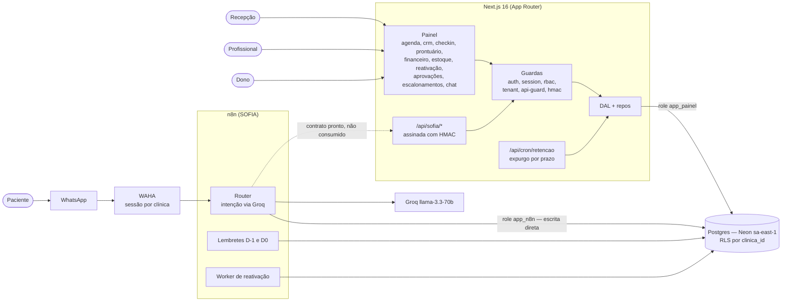
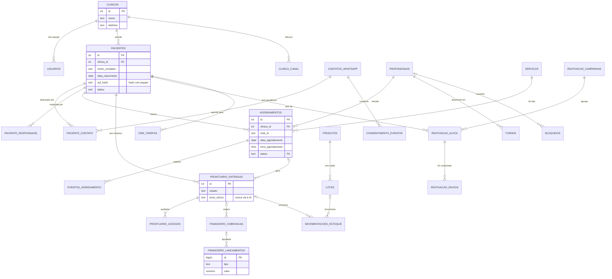
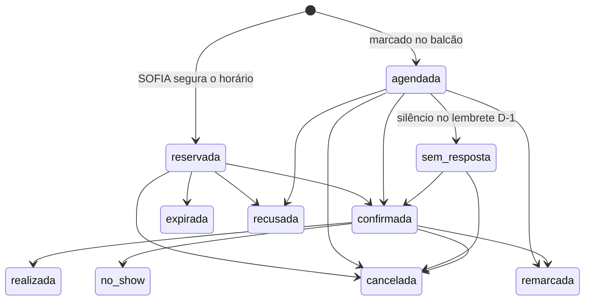
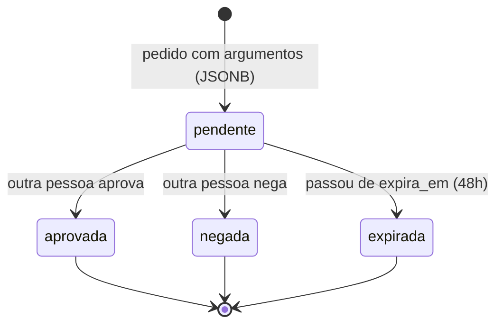
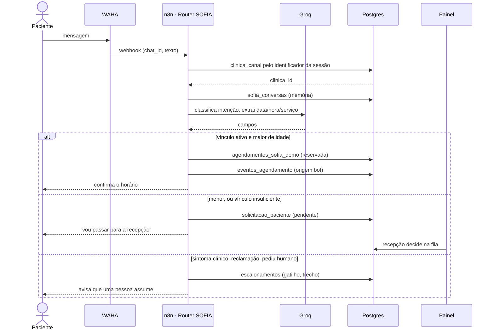
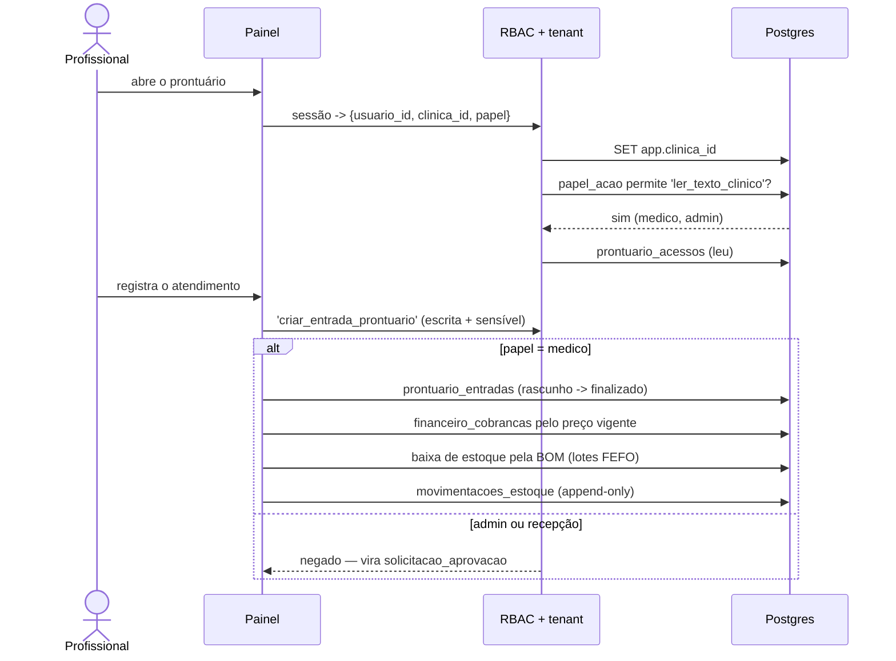

# UML

Diagramas tirados do código: as migrations em `.planning/*/sql/*.sql`, o schema
compartilhado com a SOFIA em `sofia-demo/sql/` (repositório `Demo`), e
`src/lib/status-agendamento.ts`, `src/lib/rbac.ts`, `src/lib/tenant.ts`.
Mudou o schema, o papel ou a máquina de estado, atualize aqui.

As fontes PlantUML equivalentes estão em [`uml/`](uml/).

## Componentes



A seta pontilhada é o achado central de `docs/RELATORIOS/MAPA-OPERACAO.md`
(repositório `Demo`): o contrato HMAC `/api/sofia/*` está construído dos dois
lados e ninguém o usa — a SOFIA grava por nó Postgres direto. A mesma tabela
acaba com dois donos e duas validações diferentes.

## Entidades e relacionamentos

O modelo completo (cerca de 40 tabelas) está em
[`uml/02-entidades.puml`](uml/02-entidades.puml). O núcleo:



Três livros são **append-only** por trigger, não por disciplina de quem
escreve: `financeiro_lancamentos`, `movimentacoes_estoque` e
`consentimento_eventos` (mais `chat_chamadas` e `prontuario_acessos`, que são
trilhas de auditoria). Correção é linha nova — estorno, ajuste, novo evento.

Ficam fora do isolamento por tenant, por não serem dado de clínica:
`papel`, `acao`, `papel_acao` (catálogo RBAC), `estado_*` e `transicao_*`
(máquinas de estado), `funcao_alcance` (alcance dos jobs) e as tabelas de
rate-limit `login_tentativas` / `identidade_tentativas`.

## Estados do agendamento



Silêncio não é fim: de `sem_resposta` o paciente ainda volta para
`confirmada`. Terminais: `cancelada`, `remarcada`, `realizada`.

A lista vive em `estado_agendamento` e as transições em
`transicao_agendamento` — nenhum `CHECK`, `CASE` ou união de TypeScript
repete isso sem derivar daqui. Foi exatamente assim que `pendente` e
`remarcacao_pendente` sobreviveram nos filtros dos workflows depois de
sumirem do banco, e as consultas passaram a voltar zero linhas em silêncio.

## Estados da solicitação



Vale para as duas filas: `solicitacao_aprovacao` (ação sensível pedida por
quem não pode executá-la) e `solicitacao_paciente` (pedido do WhatsApp que o
vínculo não autoriza). Quem decide não pode ser quem pediu — auto-aprovação
transformaria a fila num carimbo. O aprovador executa os `argumentos`
gravados, nunca uma reconstrução a partir do texto.

## Sequência: paciente marca pelo WhatsApp



O identificador da sessão do WAHA é a chave de entrada do tenant. O número
formatado nunca é chave: `+55 11 9…` e `5511 9…` são o mesmo telefone e
viram bug de comparação.

## Sequência: atendimento e o que ele dispara



`criar_entrada_prontuario` é só do médico: o dono da clínica lê o prontuário
mas não escreve nele. Ter o login mais forte não faz de ninguém autor de ato
clínico.

## Isolamento por clínica

Não existe lista de tabelas protegidas: `.planning/seguranca/001-lockdown.sql`
varre o `pg_catalog` atrás da coluna `clinica_id` e aplica em cada uma que
achar:

```sql
ALTER TABLE <t> ENABLE ROW LEVEL SECURITY;
ALTER TABLE <t> FORCE  ROW LEVEL SECURITY;
CREATE POLICY rls_tenant ON <t>
  USING      (clinica_id = NULLIF(current_setting('app.clinica_id', true), '')::int)
  WITH CHECK (clinica_id = NULLIF(current_setting('app.clinica_id', true), '')::int);
```

É **fail-closed**: sem o GUC na sessão, `current_setting` devolve vazio,
`NULLIF` devolve `NULL`, a comparação nunca é verdadeira e a consulta traz
zero linhas. Esquecer de setar o tenant fecha o banco em vez de abrir. E é
**FORCE**: nem o dono da tabela escapa da política — o app usa a role
`app_painel`, que é `NOBYPASSRLS`.

A role `app_n8n`, usada pela SOFIA, tem grant em poucas tabelas. Há uma
contradição em aberto registrada em `MAPA-OPERACAO.md` §2.4: os workflows
escrevem em `agendamentos_sofia_demo`, que não aparece nessa lista de grant.
`sofia-demo/sql/_diag1.sql` responde isso contra o banco vivo.
