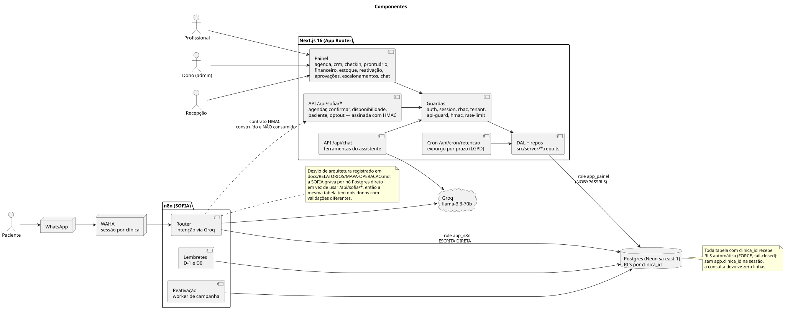
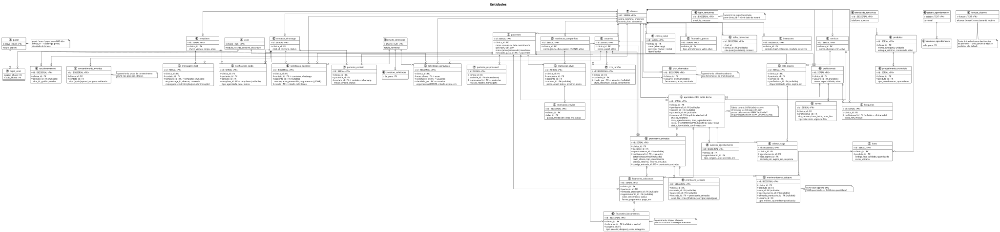
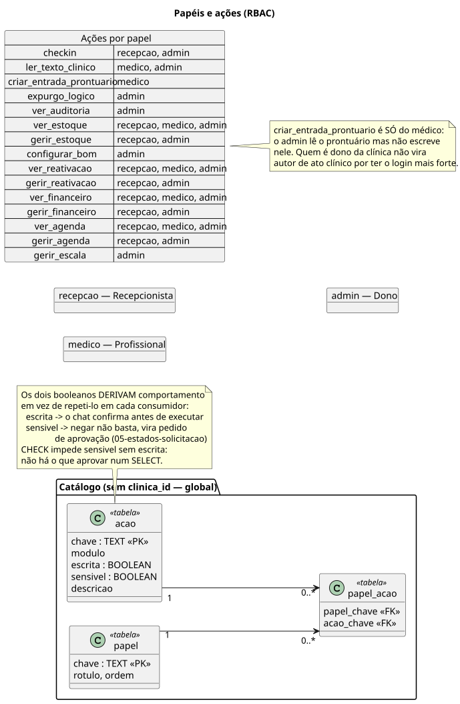
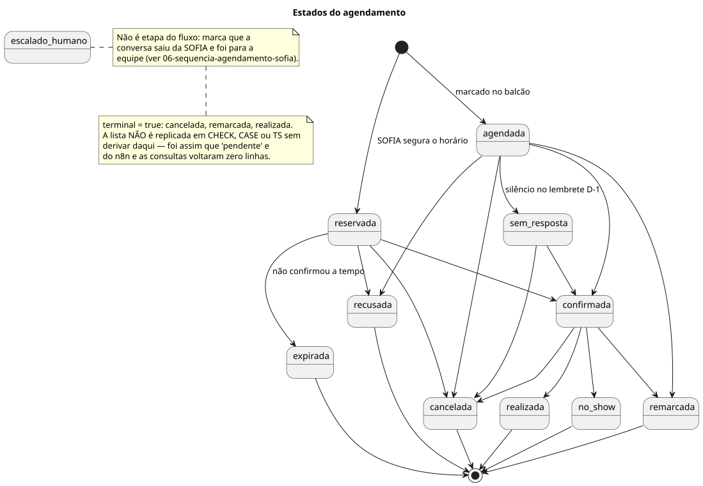
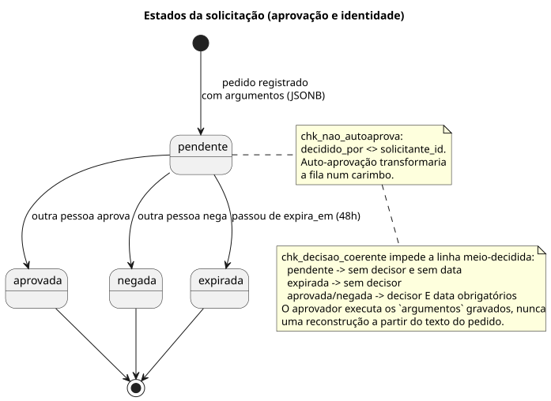
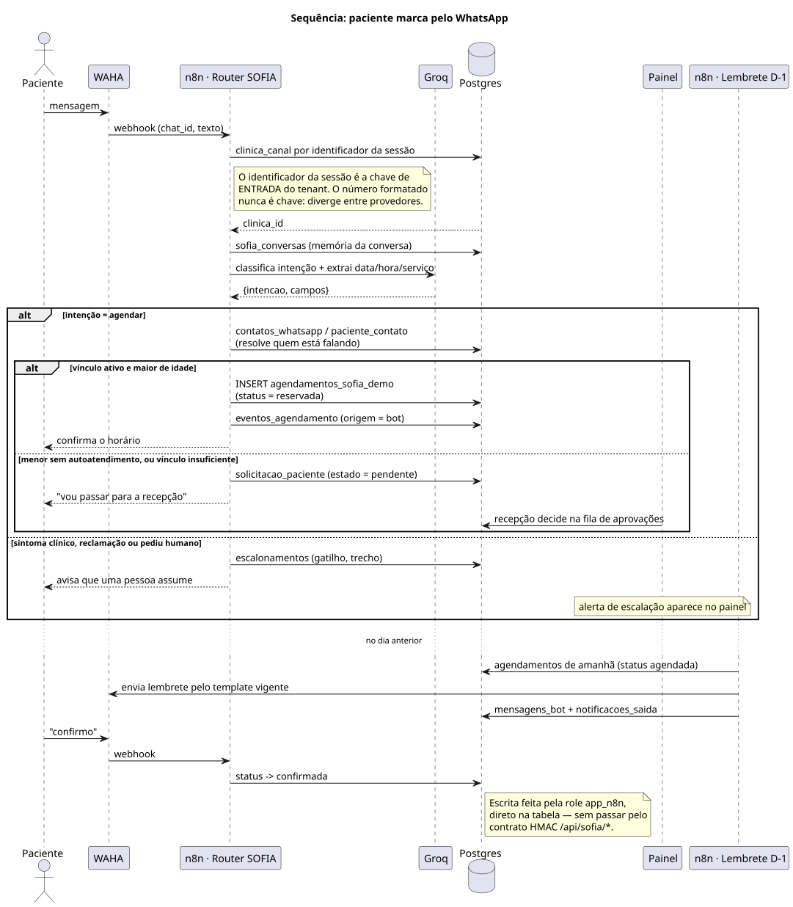
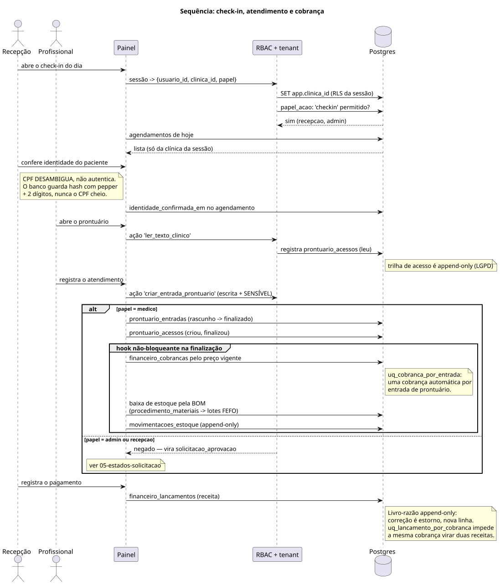
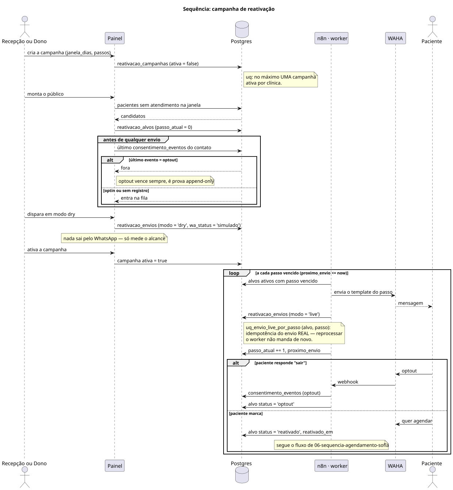
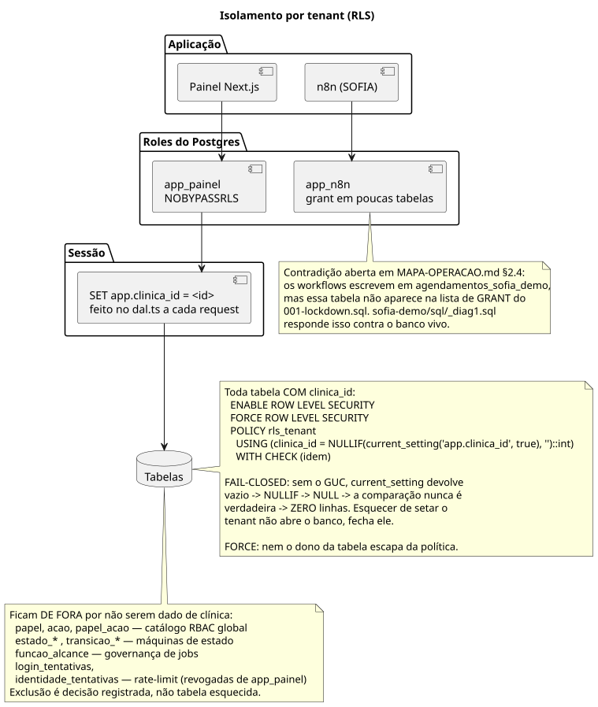

# Diagramas UML (PlantUML)

Fonte dos diagramas do sistema. A versão explicada em texto está em [`../UML.md`](../UML.md).

De onde saem: as migrations em `.planning/*/sql/*.sql`, o schema compartilhado
com a SOFIA em `sofia-demo/sql/` (repositório `Demo`) e o código em `src/lib/` e
`src/server/`. Mudou schema, papel ou máquina de estado, atualize o `.puml` e
regere a imagem.

## 01 · Componentes

Quem fala com quem, e por qual role do banco.



## 02 · Entidades

As cerca de 40 tabelas e seus relacionamentos. `clinica_id` numa tabela é o que
a coloca sob a RLS de tenant.



## 03 · Papéis e ações

A matriz de RBAC vive no banco (`papel`, `acao`, `papel_acao`), não no
TypeScript. Os booleanos `escrita` e `sensivel` derivam comportamento em vez de
repeti-lo em cada consumidor.



## 04 · Estados do agendamento



## 05 · Estados da solicitação

Mesma máquina para as duas filas: aprovação de ação sensível e pedido de
identidade vindo do WhatsApp.



## 06 · Sequência: paciente marca pelo WhatsApp



## 07 · Sequência: check-in, atendimento e cobrança

O que a finalização do prontuário dispara: cobrança pelo preço vigente e baixa
de estoque pela BOM.



## 08 · Sequência: campanha de reativação



## 09 · Isolamento por clínica



## Regerar as imagens

Precisa de Java e do `plantuml.jar` ([plantuml.com/download](https://plantuml.com/download)).

```bash
java -jar plantuml.jar -tsvg -o ../imagens docs/uml/*.puml
```

Troque `-tsvg` por `-tpng` para PNG. No VS Code, a extensão PlantUML mostra a
prévia com `Alt+D`. Para só conferir a sintaxe, sem gerar arquivo:

```bash
java -jar plantuml.jar -checkonly docs/uml/*.puml
```

| Arquivo | O que mostra |
|---|---|
| `01-componentes.puml` | Componentes do sistema e como se ligam |
| `02-entidades.puml` | Entidades do banco e relacionamentos |
| `03-papeis-acoes.puml` | Matriz de papéis e ações (RBAC) |
| `04-estados-agendamento.puml` | Estados do agendamento |
| `05-estados-solicitacao.puml` | Estados da solicitação de aprovação e de identidade |
| `06-sequencia-agendamento-sofia.puml` | Paciente marca pelo WhatsApp, da SOFIA ao banco |
| `07-sequencia-checkin-prontuario.puml` | Check-in, atendimento, cobrança e baixa de estoque |
| `08-sequencia-reativacao.puml` | Campanha de reativação e consentimento |
| `09-isolamento-tenant.puml` | Isolamento por clínica (RLS, roles, GUC) |
